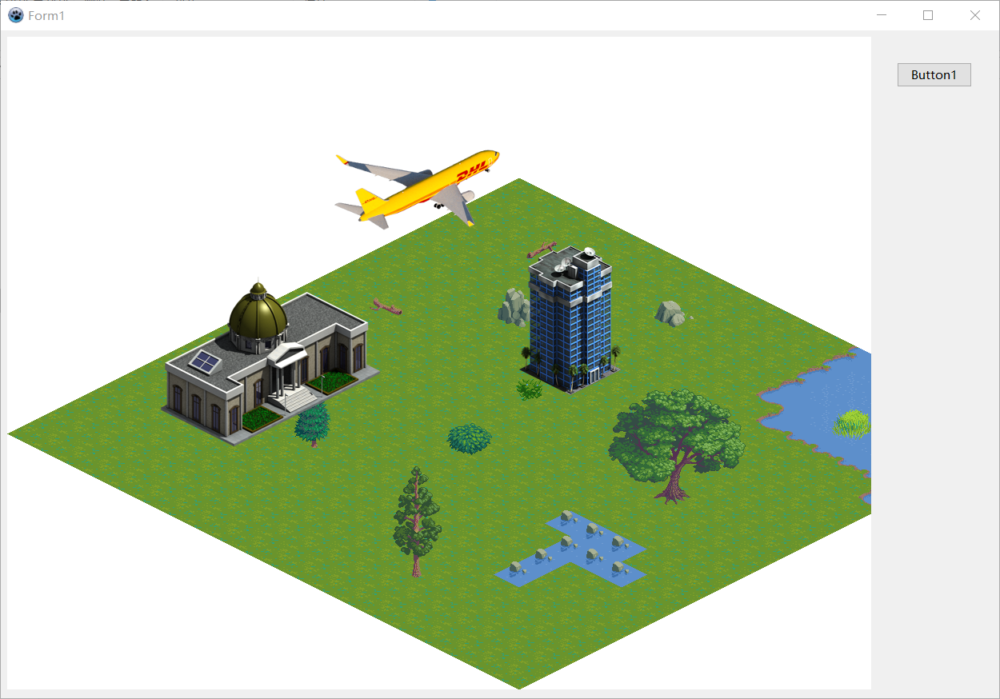

# EmbedTiledInForm
Thanks to eugeneloza,Thanks to michalis,Thanks to Castke-Engine.

Embed TCastleTiledMapControl in Form1,it works now.

IDE:Lazarus

Castle-Engine:6.5(fixed,2019-05-02)

https://github.com/castle-engine/castle-engine

https://forum.castle-engine.io/t/how-to-embed-tcastletiledmapcontrol-in-form1/71

